<!-- Date: 24 December 2015 14:35:25 -->

# Dymaxion Images

These images are from the ['Dymaxion Elevation and Shoreline Map (DESM)' article](http://bioticpixels.com/articles/dymaxion "Dymaxion Elevation and Shoreline Map (DESM)").

- [TIFFs](tiffs)
- [PNGs](pngs)

The preview images are 1280x720px minimum.

## TIFFs

Here are the full resolution, [lossless](https://en.wikipedia.org/wiki/Lossless_compression "Lossless wikipedia.org") [TIFF](https://en.wikipedia.org/wiki/Tagged_Image_File_Format "Tagged Image File Format wikipedia.org") images. They are all large, precisely 43200x21600px, and are all compressed with LZW. These files are as big as 150MB compressed, and upward of 2GB uncompressed.

### Links

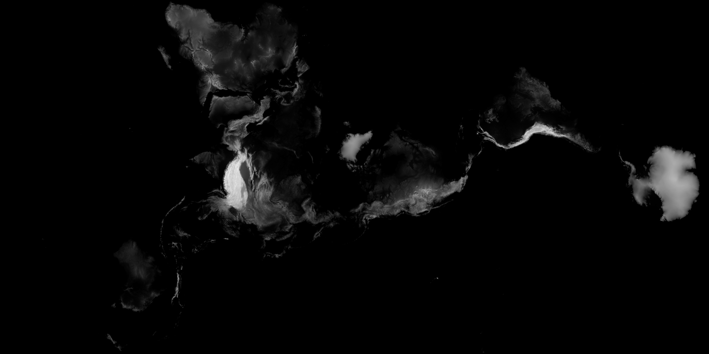
[**elevation.tif**](https://drive.google.com/file/d/0B4ugcbzXgPzQWkRORjJWVEtkWTA/view?usp=sharing "Dymaxified Elevation TIFF")  
*Size: 93.5MB*  
Dymaxified [elevation data](http://visibleearth.nasa.gov/view.php?id=73934 "NASA Visible Earth visibleearth.nasa.gov"). This has been Dymaxified directly from the GEBCO data without adding the shoreline data.  

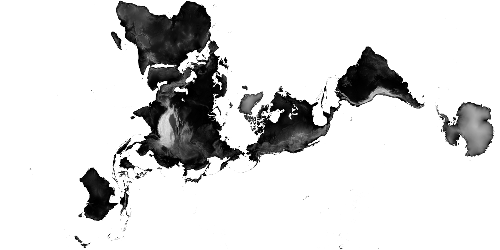
[**elevation_alpha.tif**](https://drive.google.com/file/d/0B4ugcbzXgPzQVEduYkI3S1J1bTQ/view?usp=sharing "Dymaxified Elevation with Alpha TIFF")  
*Size: 149.7MB*  
Dymaxified elevation data with background and oceans converted to alpha.  

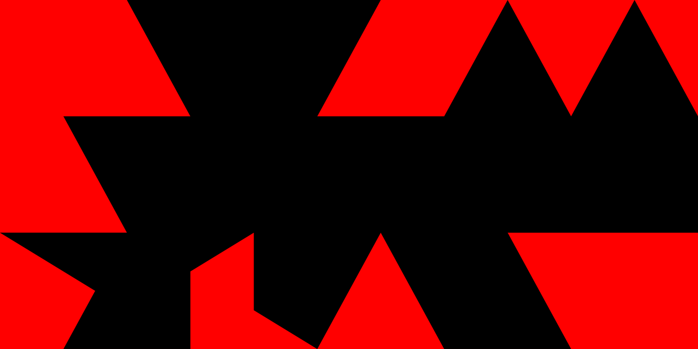  
[**background_mask_all.tif**](https://drive.google.com/file/d/0B4ugcbzXgPzQQlg0eWE5OHl3bTg/view?usp=sharing "Dymaxion Background TIFF")  
*Size: 10.3MB*  
This is the background from the Dymaxion conversion, and can be used as a mask.  

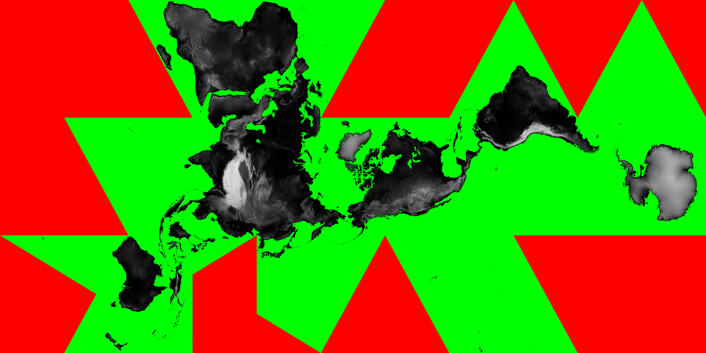
[**all.tif**](https://drive.google.com/file/d/0B4ugcbzXgPzQWkRORjJWVEtkWTA/view?usp=sharing "Dymaxified Elevation with Oceans and Background TIFF")  
*Size: 114.2MB*  
Dymaxified elevation data with the background and oceans.  

## PNGs

These [PNGs]() are all at least 5123x2880px, which is [5K resolution]().

### Links

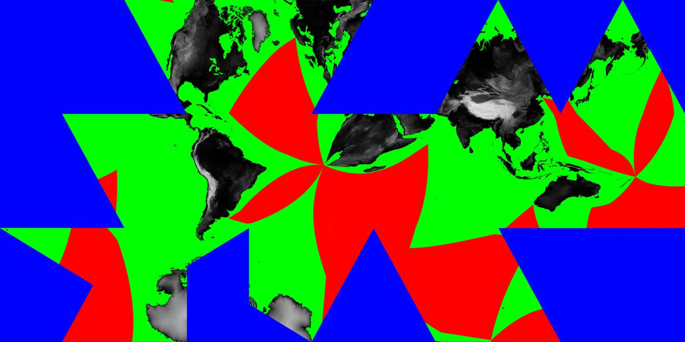 
[**all_dymaxified.png**](png/all_dymaxified.png "Double Dymaxified with Oceans and Background PNG")  
*Size: 3.6MB*  
Dymaxified elevation data with oceans and background run through the script again.

[**all.png**](png/all.png "Dymaxified Elevation with Oceans and Background PNG")  
*Size: 3.8MB*  
Dymaxified elevation data with the background and oceans. 

[**elevation_alpha.png**](png/elevation_alpha.png "Dymaxified with Alpha PNG")  
*Size: 4MB*  
Dymaxified elevation data with Alpha.

[**elevation.png**](png/elevation.png "Dymaxified Elevation Data PNG")  
*Size: 3MB*  
Dymaxified elevation data.

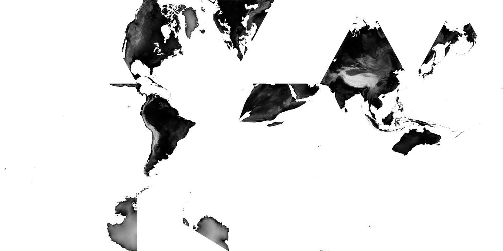
[**landmass_alpha_dymaxified.png**](png/landmass_alpha_dymaxified.png "Double Dymaxified Landmass with Alpha PNG")  
*Size: 3.4MB*  
Dymaxfified data with alpha run through the script again.

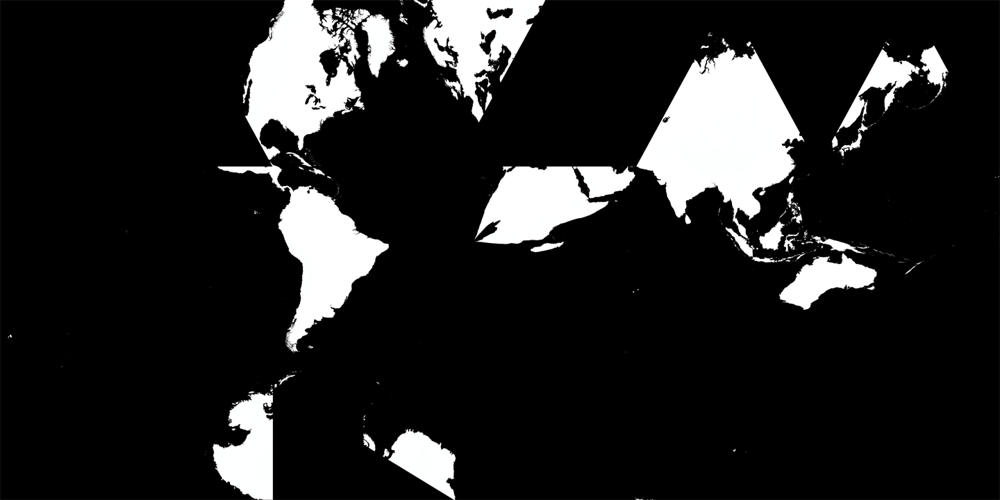
[**landmass_mask_dymaxified.png**](png/landmass_mask_dymaxified.png "Double Dymaxified Landmass Mask PNG")  
*Size: 1.4MB*  
Dymaxified landmass mask run through the script again.

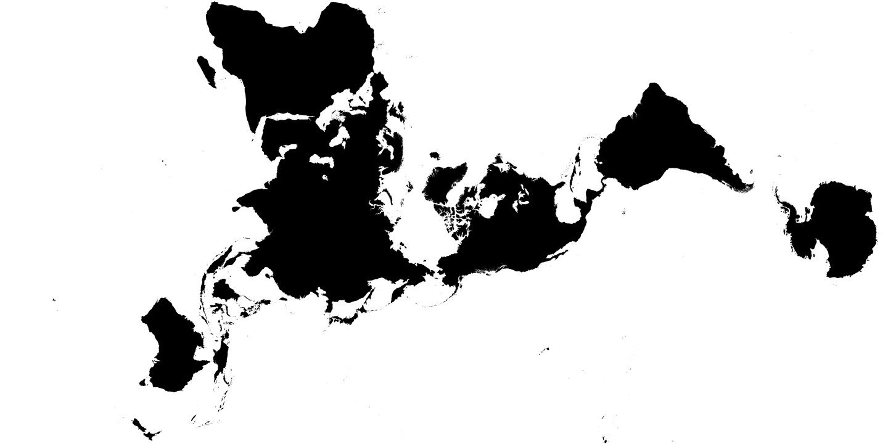
[**landmass_mask.png**](png/landmass_mask.png "Dymaxified Landmass Mask PNG")  
*Size: 1.1MB*  
Dymaxified landmass mask.

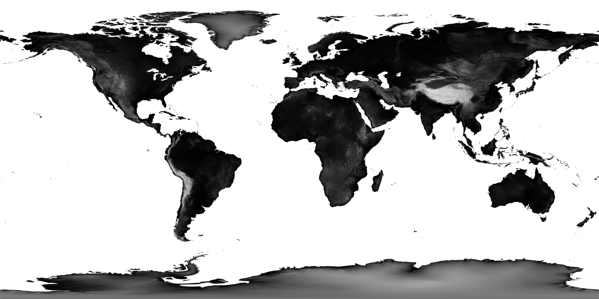
[**original_elevation_alpha.png**](png/original_elevation_alpha.png "Original Elevation with Alpha PNG")  
*Size: 3.7MB*  
Original elevation data with alpha.

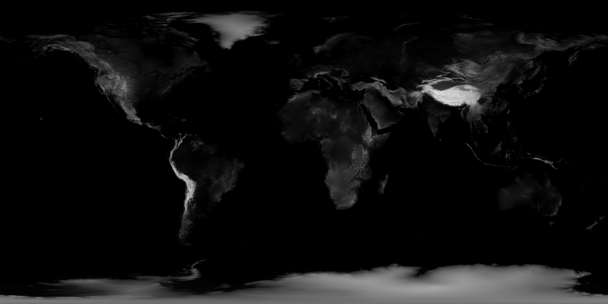
[**original_elevation.png**](png/original_elevation.png "Original Elevation PNG")  
*Size: 2.3MB*  
Original elevation data.

#### Layers

These files are for the methodology.

[**background_mask_1.png**](png/layers/background_mask_1.png "Background Mask 1 PNG")  
*Size: 158KB*  
Background mask of the bottom right section.

[**background_mask_2.png**](png/layers/background_mask_2.png "Background Mask 2 PNG")  
*Size: 175KB*  
Background mask of the top right section.

[**background_mask_3.png**](png/layers/background_mask_3.png "Background Mask 3 PNG")  
*Size: 169KB*  
Background mask of the bottom left section.

[**background_mask_4.png**](png/layers/background_mask_4.png "Background Mask 4 PNG")  
*Size: 163KB*  
Background mask of the top right section.

[**background_mask_all.png**](png/layers/background_mask_all.png "Background Mask All PNG")  
*Size: 227KB*  
All the background masks stitched together.

[**background_mask_mosaic.png**](png/layers/background_mask_mosaic.png "Background Mask Mosaic PNG")  
*Size: 255KB*  
All the background masks.

[**elevation_blue.png**](png/layers/elevation_blue.png "Elevation Blue PNG")  
*Size: 2.4MB*  
Elevation data as the blue channel.

[**landmass_mask_green.png**](png/layers/landmass_mask_green.png "Landmass Mask Green PNG")  
*Size: 2.7MB*  
Landmass mask as green.

[**masked_1.png**](png/layers/masked_1.png "Masked 1 PNG")  
*Size: 660KB*  
Masked bottom right section.

[**masked_2.png**](png/layers/masked_2.png "Masked 2 PNG")  
*Size: 1.1MB*  
Masked top right section.

[**masked_3.png**](png/layers/masked_3.png "Masked 3 PNG")  
*Size: 1.5MB*  
Masked top left section.

[**masked_4.png**](png/layers/masked_4.png "Masked 4 PNG")  
*Size: 1.2MB*  
Masked bottom left section.

[**masked_mosaic.png**](png/layers/masked_mosaic.png "Mask Mosaic PNG")  
*Size: 1.6MB*  
All masked sections.

#### Other

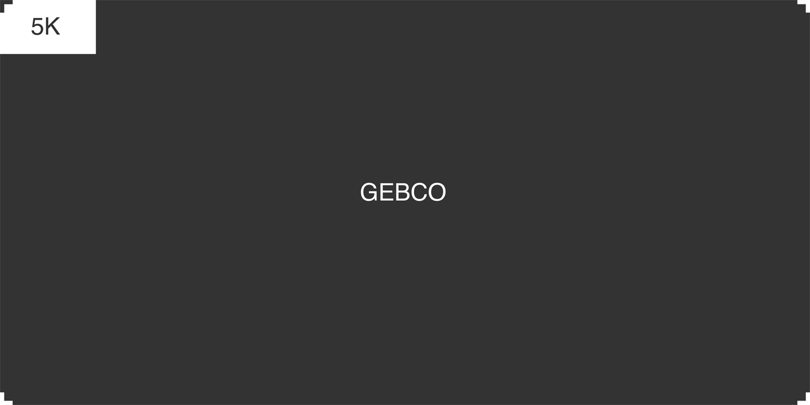
[**size_comparison.png**](png/other/size_comparison.png "Size Comparison PNG")  
*Size: MB*  
Size comparison between 5K and GEBCO resolutions.
